## 👋 Olá, eu sou o Denalth

# 🎯 Um idealista construindo sua jornada na tecnologia

Bem-vindo ao meu espaço no GitHub. Aqui registro minha evolução como idealista que está entrando no universo da tecnologia, explorando ideias, aprendendo fundamentos e transformando curiosidade em projetos reais.  

---

## 🧭 Sobre mim

Sou um idealista em início de jornada, explorando diferentes áreas da tecnologia para descobrir onde posso criar impacto real.  
Acredito em aprendizado contínuo, boas práticas e na construção de soluções funcionais e bem estruturadas.

Atualmente estudo com apoio de ferramentas de IA como **Google AI Studio**, **Antigravity**, **z.ai** e **Microsoft Copilot**, que aceleram meu processo de aprendizado e prototipagem.

---

## 📚 O que estou aprendendo

- Fundamentos de programação  
- Lógica e algoritmos  
- Desenvolvimento web  
- Git e GitHub  
- Boas práticas de código  
- Uso de IA para estudo e criação de protótipos  

---

## 🛠️ Ferramentas e Tecnologias

> Ainda definindo minha stack principal — explorando possibilidades para entender o que faz mais sentido para mim.

- HTML, CSS, PHP, PowerShell
- Python  
- Git & GitHub  
- VS Code, Antigravity  
- Ferramentas de IA (z.ai, Copilot, Google AI Studio)  
- Ferramentas de estudo e prototipagem   

---

## 🚀 Projetos e Estudos

Aqui você vai encontrar:

- Projetos pequenos criados para praticar conceitos  
- Protótipos de ideias que pretendo evoluir  
- Repositórios de estudo organizados  
- Experimentos com diferentes linguagens e ferramentas  

---

## 🧰 Ferramentas do meu dia a dia

  

---

## 🕒 Linha do Tempo de Aprendizado

- **2024** — Início dos estudos em tecnologia  
- **2024–2025** — Explorando HTML, CSS, JavaScript e Python  
- **2025** — Estudando com IA (antigravity, z.ai, Copilot, Google AI Studio)  
- **Agora** — Construindo projetos pequenos e evoluindo minha base técnica  

---

<!-- 🐍 Animação da Cobrinha -->

<picture>
  <source media="(prefers-color-scheme: dark)" srcset="https://raw.githubusercontent.com/denalth/denalth/output/github-contribution-grid-snake-dark.svg">
  <source media="(prefers-color-scheme: light)" srcset="https://raw.githubusercontent.com/denalth/denalth/output/github-contribution-grid-snake.svg">
  
</picture>

<!--
---
## 🌐 Como me encontrar

- Email: seuemail@exemplo.com  
- LinkedIn: seu-linkedin  
- Portfólio (em construção): seu-site  
-->
---

## ✨ Visão

Quero construir uma trajetória sólida na tecnologia, aprendendo com consistência e criando projetos que reflitam meu crescimento.  
Cada repositório aqui representa um passo dessa jornada — e cada passo nasce de uma ideia.
---

## 📊 Métricas do GitHub

<!--
**denalth/denalth** is a ✨ _special_ ✨ repository because its `README.md` (this file) appears on your GitHub profile.

Here are some ideas to get you started:

- 🔭 I’m currently working on ...
- 🌱 I’m currently learning ...
- 👯 I’m looking to collaborate on ...
- 🤔 I’m looking for help with ...
- 💬 Ask me about ...
- 📫 How to reach me: ...
- 😄 Pronouns: ...
- ⚡ Fun fact: ...
-->
